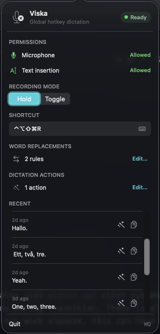
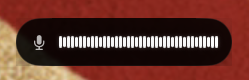
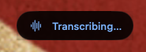

# Viska

A macOS menu bar app for global voice dictation and configurable AI-powered text transformations. Press a hotkey anywhere, speak, and insert either the transcription or a processed result at the cursor — no window switching required.

Audio transcription uses ChatGPT, with the [Codex CLI](https://github.com/openai/codex) providing local authentication. Dictation Actions use the local Codex app-server for model discovery and isolated text processing.

## Screenshots







## Features

- **Global hotkey** — trigger dictation from any app (default: `⌃⌥Space`)
- **Dictation Actions** — create named prompts for rewriting, translating, formatting, or otherwise transforming speech
- **Per-action configuration** — choose an optional global shortcut, available Codex model, reasoning effort, and prompt
- **Word Replacements** — correct recurring transcription mistakes and domain terms before insertion or action processing
- **Recent recovery** — copy previous transcripts or apply a Dictation Action and copy the result in one step
- **Two recording modes** — hold-to-record or toggle-to-record
- **Live waveform overlay** — floating capsule with real-time audio visualization while recording
- **Smart text insertion** — inserts directly via Accessibility APIs, falls back to paste, then clipboard
- **Cancel with Escape** — cancel recording or in-flight action processing
- **Menu bar status** — color-coded badge shows recording, transcription, processing, insertion, and failure states
- **Auth-aware** — detects Codex sign-in status and shows setup guidance when needed

## Requirements

- macOS 15.0 (Sequoia) or later
- [Codex CLI](https://github.com/openai/codex) installed and signed in (requires a ChatGPT Plus/Pro/Team subscription)
- Xcode 16+ (Swift 6.0) for building
- [Tuist](https://tuist.io) for project generation

## Setup

```bash
# Install Tuist if you haven't already
curl -Ls https://install.tuist.io | bash

# Clone and build
git clone https://github.com/martinj/viska.git
cd viska
./run-menubar.sh
```

On first launch, the app will request:

1. **Microphone access** — required for audio capture
2. **Accessibility access** — required for inserting text into other apps

## Usage

### Plain dictation

1. The app appears as an icon in the menu bar
2. Press the hotkey (default `⌃⌥Space`) to start recording
3. Speak your text
4. Release the hotkey (hold mode) or press it again (toggle mode) to stop
5. The transcription is inserted at your cursor

### Dictation Actions

1. Open the menu bar popover and choose **Edit…** under **Dictation Actions**
2. Add an action, then choose its name, Codex model, reasoning effort, and prompt
3. Optionally assign a global shortcut
4. Use the shortcut to record; Viska transcribes, processes, and inserts the result

Bound actions are available globally. An action without a shortcut remains saved and can still be applied to a Recent transcript.

### Recent transcripts

- Select the copy button to copy the original transcript
- Select the wand button, then an action, to process the transcript and copy the result

Applying an action does not replace the original Recent entry. Press **Escape** to cancel recording or processing.

Click the menu bar icon to change the recording mode, customize shortcuts, manage replacements and actions, recover Recent transcripts, or check status.

## How it works

```text
Plain dictation:  record → transcribe → Word Replacements → insert
Dictation Action: record → transcribe → Word Replacements → Codex processing → insert
Recent recovery:  saved transcript → Dictation Action → clipboard
```

The app communicates with a local Codex app-server process for ChatGPT authentication, model discovery, and Dictation Action processing. Each action runs in a fresh isolated turn using its configured model and reasoning effort. If processing fails or is cancelled, Viska preserves the source transcript in Recent instead of inserting it automatically.

The Codex binary is located automatically from common install paths or `$PATH`.

## Project structure

```
Sources/
├── App/            # Entry point and dependency injection
├── Audio/          # AVAudioEngine capture, WAV encoding, level analysis
├── Codex/          # Codex process management and JSON-RPC client
├── Hotkey/         # Global hotkey via Carbon Events API
├── Insertion/      # Text insertion strategies (Accessibility, paste, clipboard)
├── MenuBar/        # Status item, popover UI
├── Overlay/        # Floating recording overlay with waveform
├── Permissions/    # Microphone and Accessibility permission handling
├── Settings/       # UserDefaults-backed preferences
├── State/          # Dictation state machine and store
└── Transcription/  # ChatGPT transcription client
Tests/              # Unit tests mirroring source structure
```

Built with **SwiftUI** + **AppKit**, managed by **Tuist** (`Project.swift`).

## Development

```bash
# Build and launch
./run-menubar.sh

# Stop the running app
./stop-menubar.sh

# Generate Xcode project without building
tuist generate
```

## License

This project is not yet licensed. All rights reserved.
